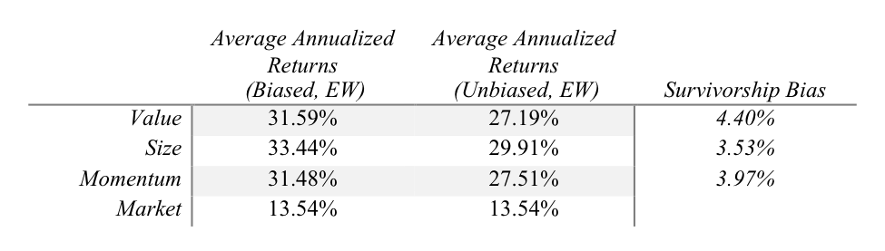

.. _survivors:

Survivorship Bias in Indian Equity Markets
-------------------------------------------

Calculating Survivorship Bias
================================

The annual survivorship biases (see Table below) for long-only EW (VW) portfolios
based on Value, Size, and Momentum are 4.4%, 3.53% and 3.97% (3.22%, 1.8%, and 0.57%),
respectively for the universe of stocks to have ever been a part of Nifty 500 Index.

To calculate the survivorship bias, we take the average annualized returns of
Unbiased Portfolios and subtract them from Average Annualized Returns of Biased
Portfolios.

.. math::

	\text{Average Annualized Bias} = R_{Biased} - R_{Unbiased}

where

1) :math:`R_{Biased}` `is Average Annualized returns on Biased Portfolio`
2) :math:`R_{Unbiased}` `is Average Annualized returns on Unbiased Portfolio`

.. raw:: html

	<iframe align = "left" width="50%" height="475" frameborder="0" scrolling="Auto" src="_static/Biased.html"></iframe>

	<iframe align = "right" width="49.5%" height="475" frameborder="0" scrolling="Auto" src="_static/BiasFree.html"></iframe>

In the figure above, on the **left** is the portfolio of the current 500 stocks
of `NIFTY 500 <https://www.nseindia.com/products/content/equities/indices/nifty_500.htm>`_
and on the **right** we take the constituents of the NIFTY 500 index to have ever existed.

	`Table 1 above shows the Annualized Average Bias on the EW Long only Fama-French Factor mimicking portfolios.`

.. figure:: _static/BiasStatsVW.png
	:align: center
	:scale: 50%

	`Table 2 shows the Annualized Average Bias on the VW Long Only Fama-French Factor mimicking portfolios.`

Most prior studies, Bahl (2006), Sehgal and Jhanwar (2007), Tripathi (2008),
Aziz and Ansari (2014), Upadhyay (2017), documenting the performance of
Fama–French factors in India failed to address the issue of survivorship bias
in their analysis and thus, may have provided potentially misleading conclusions
on their research. Agarwalla, Jacob and Varma (2013) do provide insight into the
survivorship bias in Indian equities, however, do not provide full transparency
on the methodology for their long-short portfolios. They argue that survivorship
bias calculated in their methodology is negligible, which we believe is significantly
underestimated, even though their sample, constituents of
Bombay Stock Exchange (BSE), is different than our sample.
However, most firms that trade on NSE, especially on Nifty 500, also trade on BSE.

Firstly, Agarwalla, Jacob, and Varma (2013) mention that most of the vanishing
firms in their data were from the bottom 2 deciles based on market capitalization
thus leading to negligible bias, however, they fail to account for firms that were
delisted due to reasons other than mergers and distress. We document all the
firms delisted and suspended in our sample, irrespective of the reasons and can
confirm to the best of our knowledge that out of 1,117 firms, 76 firms vanished
due to mergers and 78 of them vanished due to reasons other than mergers. Also,
the market capitalization of these 78 stocks on their last trading days,
respectively, totaled up to 0.81% (See Appendix) of Nifty 500’s total market
capitalization as on September 29, 2017.

Secondly, they provide a survivorship bias for the Fama-French factors and the
Momentum factor, namely HML, SMB and WML that takes into account both long and
short positions, the latter of which we discuss further in our paper is
premature because of short selling frictions.

Lastly, all of the prior literature, fails to properly consider the ban on short
selling in India by retail investors from 2001 to 2003 and by Institutional
Investors, both Foreign and Domestic from 2001 – 2007 after the scam involving
Ketan Parekh (SEBI, 2007). Thus, computing expected returns of individual
securities, as is done by prior researchers, without accounting for above
regulatory restriction could be misleading.

Understanding Survivorship Bias
==================================

In studying the performances of portfolios, components of which are chosen from
an index or not, it becomes imperative to retain performances of all dead stocks
or stocks that were a part of index but were excluded at some point of time during
the period of study. In other words, retaining performance of stocks that have not
“survived” to the end of the data set. This is done in order to remove biases that
may arise from capturing performance of stocks/funds that did well and thus
survived and not documenting performance of stocks/funds that died, got
suspended/delisted or removed from an index due to poor performance.

Specific to our research, studying performance of only the current constituents
of the index introduces a bias as it only includes stocks that have survived
through the testing period by displaying characteristics as defined by the
index’s requirements. This will of course have an upward bias as the current
constituents of the Index that do not include any dead/suspended stocks, the
latter of which are in most case removed from the index due to poor performance,
if not compliance.

Many researchers like Brown and Goetzmann (1994), Grinblatt and Titman (1989)
and Malkiel (1994) have documented the importance of Survivorship Bias while
studying the performance of mutual funds. Brown and Goetzmann (1994) established
two samples, one free from survivorship bias, where they record all the mutual
funds that existed in any given year in the period of study i.e. 1976 – 1988,
and other containing mutual funds, on the last year of study i.e. 1988. However,
they address the problem of not tracking funds that disappear from Wiesenberger
in cases where Wiesenberger does not record the reasons of disappearance,
but estimate a bias, had the record been proper, to be between 20 and 80 basis
points. They also conclude that poor performance generally resulted in the
disappearance of these mutual funds. Malkiel (1994), like Brown and Goetzmann,
tracks performance of funds to have ever existed during the time of study and
concludes the bias to be 150 basis points annually.

CNX 500 and our constituents
==============================
The methodology of Nifty 500 Index (IISL, 2017), also called CNX 500,
indicates the eligibility criteria for securities to be a part of the Index.
In order for the stocks to be included in the Index, they have to be a part of
the eligible universe, which includes:

- `Companies ranked within top 800 based on both average daily turnover and average daily full market capitalization based on previous six months period data`
- `Companies traded for at least 90% of days during the previous six months period`
- `Securities will be included if rank based on full market capitalization is among top 350`
- `Securities will be included if full market capitalization is twice of the last constituent in NIFTY 500`
- `Securities will be excluded if rank based on full market capitalization falls below 800`

Thus, we believe that companies that are removed from the index may have been
done so primarily because of poor performance and then due to compliance issues,
hence leading to upward bias when only selecting current survived constituents.
We have provided the number of constituents in the Survivorship Bias Free and
Survivorship Biased Universe in Table 7.

In studying the performances of portfolios, components of which are chosen from
an index or not, it becomes imperative to retain performances of all dead stocks
or stocks that were a part of index but were excluded at some point of time during
the period of study. In other words, retaining performance of stocks that have not
“survived” to the end of the data set. This is done in order to remove biases that
may arise from capturing performance of stocks/funds that did well and thus
survived and not documenting performance of stocks/funds that died, got
suspended/delisted or removed from an index due to poor performance.

Specific to our research, studying performance of only the current constituents
of the index introduces a bias as it only includes stocks that have survived
through the testing period by displaying characteristics as defined by the
index’s requirements. This will of course have an upward bias as the current
constituents of the Index that do not include any dead/suspended stocks, the
latter of which are in most case removed from the index due to poor performance,
if not compliance.

Many researchers like Brown and Goetzmann (1994), Grinblatt and Titman (1989)
and Malkiel (1994) have documented the importance of Survivorship Bias while
studying the performance of mutual funds. Brown and Goetzmann (1994) established
two samples, one free from survivorship bias, where they record all the mutual
funds that existed in any given year in the period of study i.e. 1976 – 1988,
and other containing mutual funds, on the last year of study i.e. 1988. However,
they address the problem of not tracking funds that disappear from Wiesenberger
in cases where Wiesenberger does not record the reasons of disappearance,
but estimate a bias, had the record been proper, to be between 20 and 80 basis
points. They also conclude that poor performance generally resulted in the
disappearance of these mutual funds. Malkiel (1994), like Brown and Goetzmann,
tracks performance of funds to have ever existed during the time of study and
concludes the bias to be 150 basis points annually.

* **Survived Companies**
	We commence our research by understanding the trends in Indian Markets to see the total
	companies trading at a point of time :math:`T_n` We do this to understand the survivorship bias
	and to reveal the most apparent reasons for Delisting of any company.

.. raw:: html

	<iframe align = "center" width="950" height="600" frameborder="0" scrolling="no" src="_static/NSE_Ticks.html"></iframe>

* **Delisting reasons for further forecast**

  We find the information to further forecast the credit rating of a company and use machine
  learning algorithm to forecast companies that are susceptible to failing by region.

* **Consolidating missing data for Suspension, Delisting, Merger etc.**

  Further, we consolidate our data for dates when the Stock got delisted, suspended or was off
  the exchange for any other reason, with the dates for which the data for the same stocks is unavailable.

.. raw:: html

	<iframe align = "center" width="950" height="650" frameborder="0" scrolling="no" src="_static/Delisting Reasons since 2001.html"></iframe>

* **Replicate for BSE**

  Once we perform the above research for `National Stock Exchange <https://www.nseindia.com>`_ we conduct the same research for `Bombay Stock Exchange. <http://www.bseindia.com/>`_

  It is interesting to see the from the period 2003-2006, both NSE and BSE saw a sharp decline of listed companies albiet delisting of companies
  The reasons for delisting are already mentioned, however, in 2004, 913 companies were delisted out of which 876 were compulsory delistings
  use to non compliance of Securities and Exchange Board of India's (`SEBI <http://www.sebi.gov.in/>`_) Guidelines.

 .. raw:: html

	<iframe align = "center" width="950" height="650" frameborder="0" scrolling="no" src="_static/chart.html"></iframe>
