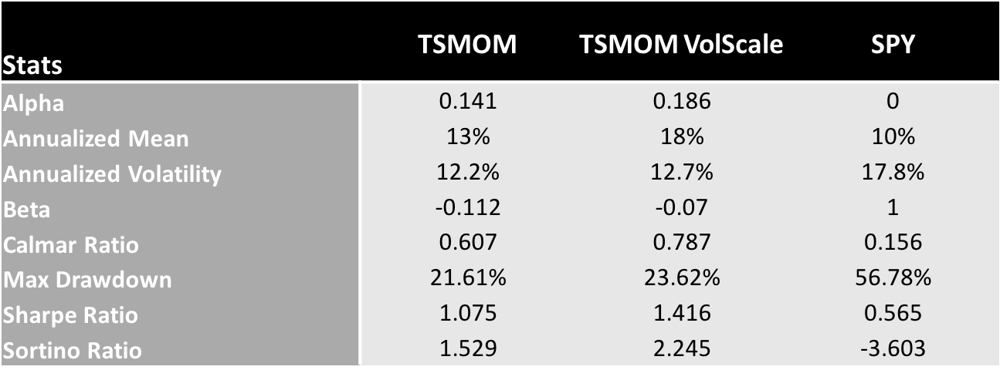

CTA TSMOM
===========

Backtest Data and Methodology
---------------------------------
As we compute a market anomaly for Time Series Momentum, which is different
than the Momentum in finance literature, as documented by `Jegadeesh and Titman (1993)`,
we establish strong relationship of securities returns with its past returns. We
start with 54 continuous futures contracts covering

- Equity Index Futures
- FX Futures
- Bond Futures
- Commodity Futures

For our Levered positions, we use the scaling factor of :math:`\frac{20\%}{\sigma_{t-1}^s}`

Results
---------

We provide the interactive plots and data below, along with summary statistics.

- Summary Statistics

.. raw:: html

	<iframe align = "center" width="100%" height="650" frameborder="0" scrolling="auto" src="_static/CTAPort.html"></iframe>

.. raw:: html

	<iframe align = "left" width="50%" height="520" frameborder="0" scrolling="auto" src="_static/CTAAnnRet.html"></iframe>

  <iframe align = "right" width="50%" height="520" frameborder="0" scrolling="auto" src="_static/CTAVolAnnRet.html"></iframe>

.. raw:: html

  <iframe align = "left" width="50%" height="350" frameborder="0" scrolling="auto" src="_static/CTADrawdown.html"></iframe>

  <iframe align = "right" width="50%" height="350" frameborder="0" scrolling="auto" src="_static/CTAVolDrawdown.html"></iframe>

.. raw:: html

    <iframe align = "left" width="49%" height="600" frameborder="0" scrolling="auto" src="_static/CTAHeatmap.html"></iframe>

    <iframe align = "right" width="49%" height="600" frameborder="0" scrolling="auto" src="_static/CTAVolScaleHeatmap.html"></iframe>
