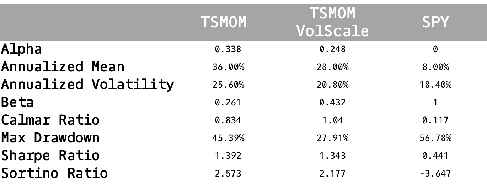

TSMOM in ETFs
===============

Backtest Data and Methodology
--------------------------------
We then proceed our research with most liquid ETFs by Dollar Volume as of February
end, 2018. Although, this introduces a look ahead bias in our backtest, as some of these
ETFs saw a large spike in volume during the recent market pullback, we conducted tests
every year to check the volume of the ETFs in our research period, which made us conclude to choose
the 100 ETFs. You can download the :download:`list<_static/ETFList.txt>` of ETFs here.

For our Levered positions, we use the scaling factor of :math:`\frac{40\%}{\sigma_{t-1}^s}`

Results
-------------

We provide the interactive plots and data below, along with summary statistics.

- Summary Statistics

.. raw:: html

	<iframe align = "center" width="100%" height="650" frameborder="0" scrolling="auto" src="_static/ETFPort.html"></iframe>

.. raw:: html

	<iframe align = "left" width="50%" height="520" frameborder="0" scrolling="auto" src="_static/ETFAnnRets.html"></iframe>

  <iframe align = "right" width="50%" height="520" frameborder="0" scrolling="auto" src="_static/ETFVolAnnRets.html"></iframe>

.. raw:: html

  <iframe align = "left" width="50%" height="400" frameborder="0" scrolling="auto" src="_static/ETFUnderwater.html"></iframe>

  <iframe align = "right" width="50%" height="400" frameborder="0" scrolling="auto" src="_static/ETFVolUnderwater.html"></iframe>

.. raw:: html

    <iframe align = "left" width="49%" height="600" frameborder="0" scrolling="auto" src="_static/ETFHeatmap.html"></iframe>

    <iframe align = "right" width="49%" height="600" frameborder="0" scrolling="auto" src="_static/ETFHeatmapVol.html"></iframe>
