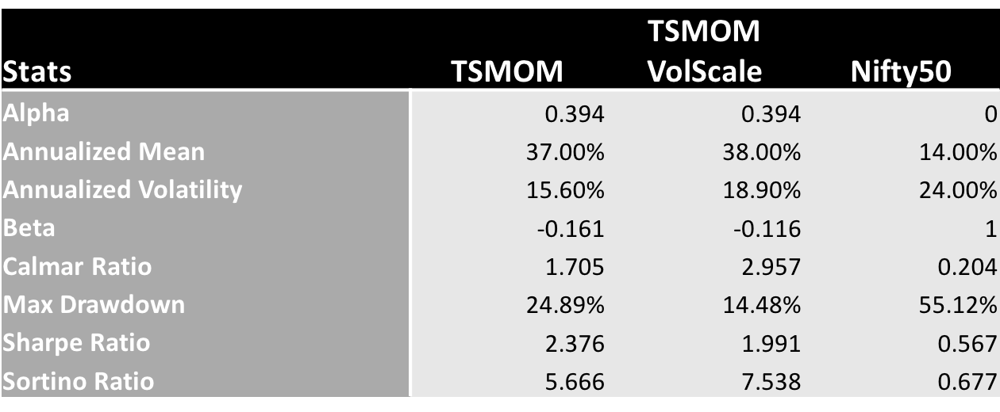
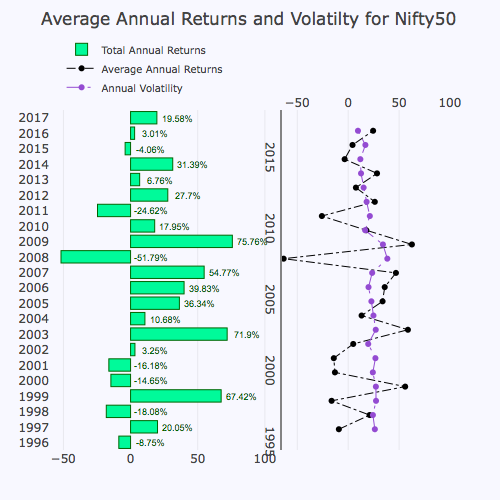

TSMOM in Indian Equities
==========================

Backtest Data and Methodology
--------------------------------
We conclude our research with most liquid stocks in Indian Equities as of September 2017.
Although, this is a survivorship bias portfolio, we also provide an Equally Weighted
Long Only portfolio, rebalanced monthly, in our backtest for comparison.

Indian Equities are more volatile than the US markets, as shown in the ex-ante volatility
that were far greater than any mid-cap stocks in US equities, thus scaling the positions
here helped us reduce the volatility of portfolios

For our Levered positions, we use the scaling factor of :math:`\frac{50\%}{\sigma_{t-1}^s}`

Results
---------

We provide the interactive plots and data below, along with summary statistics.

- Summary Statistics

.. raw:: html

	<iframe align = "center" width="100%" height="650" frameborder="0" scrolling="auto" src="_static/IndiaMom.html"></iframe>

.. raw:: html

	<iframe align = "left" width="50%" height="550" frameborder="0" scrolling="auto" src="_static/IndAnnRet.html"></iframe>

  <iframe align = "right" width="50%" height="550" frameborder="0" scrolling="auto" src="_static/IndVolAnnRet.html"></iframe>

.. raw:: html

  <iframe align = "left" width="50%" height="400" frameborder="0" scrolling="auto" src="_static/IndUnderwaterUnLevered.html"></iframe>

  <iframe align = "right" width="50%" height="400" frameborder="0" scrolling="auto" src="_static/IndUnderwaterVol.html"></iframe>

.. raw:: html

    <iframe align = "left" width="49%" height="600" frameborder="0" scrolling="auto" src="_static/IndMomHeatmap.html"></iframe>

    <iframe align = "right" width="49%" height="600" frameborder="0" scrolling="auto" src="_static/IndMomVolScaleHeatmap.html"></iframe>
