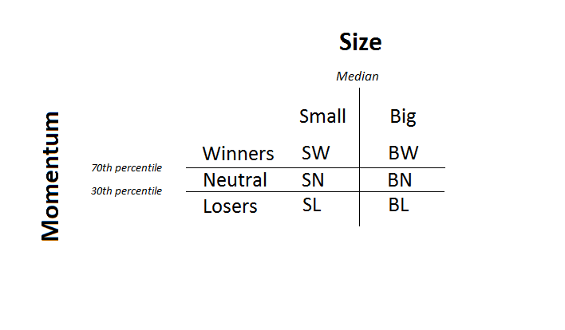

.. _method-india:

Methodology for India
=======================

For each of the methodology below, we rebalance the portfolio every month and deploy a buy and hold strategy for ``currently`` equally weighted portfolio.

Initial Steps
--------------

Our present approach is to test our hypothesis, whether Fama/French factor portfolios can be applied to India, on all the constituents
of `NIFTY 500 Index <https://www.nseindia.com/products/content/equities/indices/nifty_500.html>`_

- Filtering Stock Price data:
	Our main source of data is ProwessDx, which provides fundamental data on almost 23000 public companies since 1900. The data source
	ProwessDx also contains Closing Prices for NSE and BSE stocks. We adjust Closing Prices for stock splits and dividends by the factor provided
	by ProwessDx at a particular date.

- Filtering Fundamental data:
	About 89% of the companies in India [#]_ file their financial statements on 31st March of every year. Assuming a 3 month
	lag before this information is available to public, we sort our portfolios on 1st July every month and rebalance every month for
	an equally weighted portfolio. We front fill any fundamental data not available for a particular quarter or year. We noticed that
	the front filling was not extensive as ProwessDx provided very exhaustive and comprehensive data for both BSE and NSE companies

	We have illustrated our findings of the BM ratio and ME ranges from 1995 to 2017 for all 2756 NSE [#]_ that have been listed ever on NSE,
	out of which only 1681 survived by March of 2017.

.. raw:: html

	<iframe align = "center" width="100%" height="600" frameborder="0" scrolling="auto" src="_static/btom_rnge.html"></iframe>

	<iframe align = "center" width="100%" height="600" frameborder="0" scrolling="auto" src="_static/ME_range.html"></iframe>

The total number of NSE and BSE companies that have survived as of March 2017 are illustrated below. The data accounts for
suspensions and delisting for firms and include companies only.

.. raw:: html

	<iframe align = "left" width="49%" height="400" frameborder="0" scrolling="auto" src="_static/NSE_survivors.html"></iframe>

	<iframe align = "right" width="49%" height="400" frameborder="0" scrolling="auto" src="_static/BSE_Survivors.html"></iframe>

1-Dimensional Sorting
----------------------------

We apply the standard practice for sorting Winners and Losers as mentioned by Jegadeesh and Titman [#]_ where the stocks are ranked based on their cumulative returns for the past
eleven months i.e :math:`t-12` to :math:`t-1`, excluding the most recent month as it is not an indicator of momentum. The top 30% are considered as the Winners and bottom 30% are considered
Losers. For the 1-D portfolios, we simply buy the Winners and short sell the Losers, thus to form Winners minus Losers (WML)

.. math::

	\text{WML = Winners stocks - Losers stocks}

Further, to sort one dimensionally for size, we first looked at the distribution of Market Equity for the NSE `sample` stocks over the timespan we covered and decided to chose the
median ME for the sample stocks as the breakpoint, where Small is :math:`< \text{Median}` and Big is :math:`\geq \text{Median}`, thus to form, Small Minus Big(SMB)

.. math::

	\text{SMB = Small stocks - Big stocks}

A similar approach was then used to sort one-dimensionally based on value using the Book-to-Market (BM) ratio. The cutoff points are the sample stocks' 30% 70% and 100% quintiles,
deciles, where High BM stocks are :math:`\geq \text{70th percentile}` and Low BM stocks are :math:`< \text{30th percentile}`, thus to form High Minus Low (HML)

.. math::

	\text{HML = High BM stocks - Low BM stocks}

2-Dimensional Sorting
----------------------

- For 2-D sorting, we use the intersection of `2 X 3` portfolios for Size and Value, `2 X 3` portfolios for Size and Momentum and `3 X 3` portfolios for Momentum and Value.
  The intersectional sorts uses 3 parameters

  i. :math:`\text{B/M}`
  ii. :math:`\text{ME}`
  iii. :math:`\text{Cumulative returns or MOM}`

  The figures below illustrate the sorted clusters of a sample of 300 stocks for different periods based on the ME and B/M ratio. The sorting
  was done using the cutoff points described above.

.. raw:: html

	<iframe align = "left" width="50%" height="350" frameborder="0" scrolling="no" src="_static/sorting_small2017.html"></iframe>

	<iframe align = "right" width="50%" height="350" frameborder="0" scrolling="no" src="_static/sorting_small2016.html"></iframe>

	<iframe align = "left" width="50%" height="350" frameborder="0" scrolling="no" src="_static/sorting_small2015.html"></iframe>

	<iframe align = "right" width="50%" height="350" frameborder="0" scrolling="no" src="_static/sorting_small2009.html"></iframe>

The methodology for **2-D** sorting for `Momentum` and `Size` is illustrated below.

- In the case above for the cross section of `2 X 3` portfolios for Size and Momentum

.. math::

	    WML_{(ME)} = \frac{1}{2}(SW + BW) - \frac{1}{2}(SL + BL)

.. math::

	    SMB_{(MOM)} = \frac{1}{3}(SW + SN + SL) - \frac{1}{3}(BW + BN + BL)

- Similarly, we find the cross sections for `2 X 3` portfolios for **Size & Value** and `3 X 3` portfolios for **Momentum and Value.**  The cross sections of these portfolios provides us

	i. :math:`WML_{(ME)}`
	ii. :math:`WML_{(B/M)}`
	iii. :math:`SMB_{(MOM)}`
	iv. :math:`SMB_{(B/M)}`
	v. :math:`{HML}_{(ME)}`
	vi. :math:`{HML}_{(MOM)}`

- To finally arrive at the :math:`SMB, HML, WML` we take the average of the factors conditioned on two other parameters.

.. math::
		{SMB} = \frac{1}{2}(SMB_{(MOM)} + SMB_{(B/M)})

.. math::

		{HML} = \frac{1}{2}( HML_{(ME)} + HML_{(MOM)} )

.. math::
		{WML} = \frac{1}{2}( WML_{(ME)} + WML_{(B/M)})

.. rubric:: Footnotes

.. [#] `Agarwalla, S. K., Jacob, J. and Varma, J. R. (2013), Four factor model in Indian equities market, Working Paper W.P. No. 2013-09-05, Indian Institute of Management, Ahmedabad.`

.. [#] `ProwessDx Data`

.. [#] `Jegadeesh, N. and Titman, S. (1993), ‘Returns to buying winners and selling losers: Implications for stock market efficiency’, The Journal of Finance 48(1), 65–91.`
