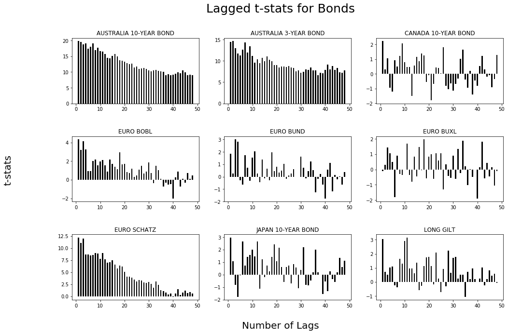
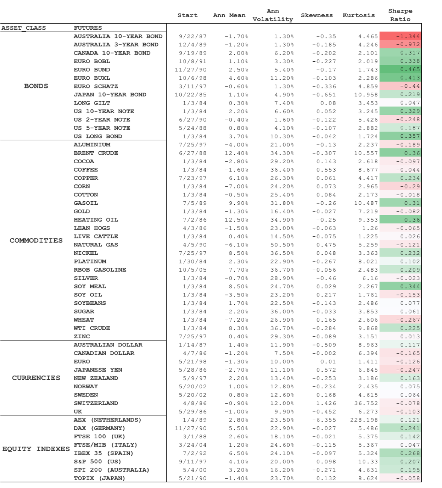

.. _tsmom-method:

Methodology for TSMOM
=======================

Data
-----

The data have been extracted primarily from Centre for Monitoring Indian Economy (`CMIE ProwessDx <https://www.cmie.com/kommon/bin/sr.php?kall=wproducts&tabno=7010&prd=prowessdx&portal_code=030010040005000000000000000000000000000000000>`_).
ProwessDx delivers financial performance data and markets data on Publicly Listed
companies in India. Other data sources are Quantopian research, Quandl and Yahoo Finance

Proof of Momentum
---------------------

The main premise of Time Series Momentum is that past returns can be used as
a robust indicator of future returns, implying if the stocks have had positive
returns in the past, they would continue to do so in the future on average.

To establish the above said relationship, we regress we find proof of momentum
within an asset by regressing its returns, lagged for a certain period
on today's returns. For example if we want to establish relationship of today's
returns with yesterday's returns, we will simply regress the security's returns
with itself lagged by 1 day ie

.. math::

  r_{t} = c + \beta_{1}r_{t-1} + \epsilon

where,

- :math:`r_{t}` is today's excess returns

- :math:`c` is the intercept

- :math:`\epsilon` is the white noise

- :math:`\beta_{1}` is our parameter

If the `t-stat` for our  :math:`\beta_{1}` is :math:`\geq{2} \text{ or} \leq{-2}`,
we have significant proof that there is a relationship. We thus perform the same
process for monthly returns lagged for 40 months on all of our securities

.. math::

  r_{t}^s = c + \sum_{i=1}^{40}{\beta_{i}r_{t-i}^s} + \epsilon

We plot our t-stats for Bond Futures and find a very strong relationship over
the research study time. For futures, we start from January 1, 1985 to September 2016,
for ETF's we conduct our research starting from 1 January, 2003 till end February
and for Indian Equities we cover the period starting from March 31, 1995 to September 29, 2017.

In the `Figure` above, we notice a momentum for 24-30 months in the Bond Futures
and then see a reversal trend for most of the securities.

The summary for CTA securities, including the sharpe ratio is provided below. Click
on the picture to enlarge.

Signal Generation
------------------

Recall our regression on lagged returns of the security. Our parameter `t-stat`
will either be positive or negative.

.. math::

  r_{t}^s = c + (sign)\beta_{h}r_{t-h}^s + \epsilon

Here :math:`sign` will be our signal generator, which implies if the past h month return,
excluding the most recent month, is positive (**+**), we will go short. If the same number is negative
(**-**), we will go short.

We choose our look back period to be 12 months and our holding period to be 1 month.

.. math::

  r_{t,t+1}^{TSMOM, s} = (sign)r_{(t-12, t)}^{s}r_{(t, t+1)}^s

where,

- :math:`r_{t,t+1}` is the TSMOM return for the next month for security `s`

- :math:`sign` is either positive negative on the past 12 month returns

- :math:`r_{(t-12, t)}^{s}` is the 12 month return for security `s`.

For example, let's say the returns for February, 2018 for SPY are :math:`-3.52\%`
and the past 12 month returns are :math:`-10\%`. Since our *sign* is negative,
we will sell short SPY and our returns for February will be :math:`(sign)-3.52\%`
or just :math:`3.52\%`

Volatility Scaling
--------------------

To further reduce our volatility, we also scale our positions by scaling the
ex-ante volatility of each security. This makes sense intuitively for the reasons
mentioned in the paper and also for the fact that during high volatility periods,
we well decrease our position size because of drastic increase in ex-ante volatility.

We use the scale as 20%, else, we find our leverage to increase significantly during
low volatility bull market periods. **We will call this portfolio TSMOM VolScale**
and the **unlevered portfolio as just TSMOM.**

The scaling factor thus is: :math:`\frac{20\%}{\sigma_{t-1}}`. So our complete equation then becomes:

.. math::

  r_{t,t+1}^{TSMOM VolScale, s} = (sign)r_{(t-12, t)}^{s}\frac{20\%}{\sigma_{t-1}}r_{(t, t+1)}^s
